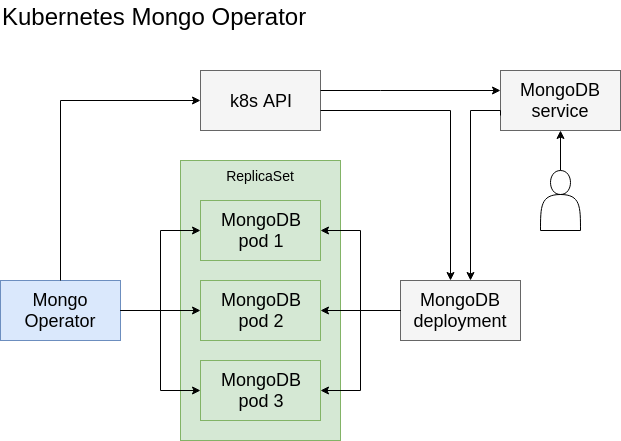

# k8s-mongo-operator
MongoDB Operator for Kubernetes

## Architecture
The following diagram shows how the operator communicates with the Kubernetes API and Mongo instances to manage a MongoDB replica set in your cluster.

## Running it locally
- Make sure you have [Docker](https://store.docker.com/search?type=edition&offering=community) running.
- Make sure you have [MiniKube v0.25.2](https://github.com/kubernetes/minikube/releases/tag/v0.25.2) running.
- Run `./buld-and-deploy-local.sh`
  - This will build, deploy the operator and stream the pod logs into the output.
